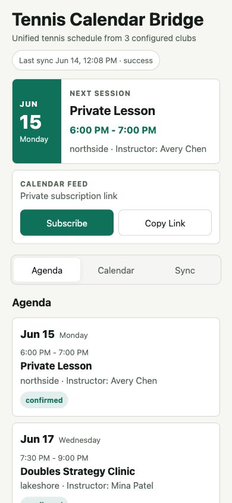
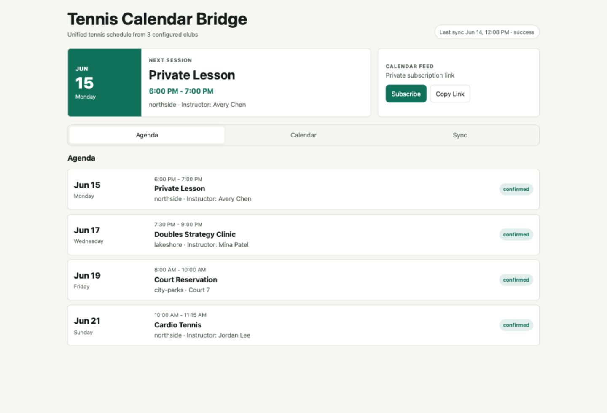

# Tennis Calendar Bridge

Tennis Calendar Bridge is a private-first schedule aggregator for tennis clubs,
training centers, and court-booking portals. It logs in to configured provider
sites, normalizes reservations and lessons into one SQLite-backed event store,
and publishes a private iCalendar feed that can be subscribed to from Apple
Calendar, Google Calendar, or any calendar client that supports `.ics` feeds.

The project started from a real multi-club scheduling workflow, but the design is
not tied to one city or one club. New providers can be added as scraper adapters,
and deployment is intentionally boring: a small Python service, Docker Compose,
and optional Ansible support for a VPS.

## Why This Exists

Club portals are optimized for booking inside one facility. Players who train or
reserve courts across multiple clubs often end up checking several websites to
answer a simple question: "When am I playing next?"

This service gives those bookings a single calendar-shaped interface without
asking for write access to a personal calendar account.

## Features

- Playwright-based login and scraping for provider portals.
- Provider adapters for Club Automation, AccuSportView, and CourtReserve-style
  portals.
- Normalized event storage in SQLite.
- Private iCalendar feed at `/calendar/<token>/tennis.ics`.
- Small web dashboard with next-session, agenda, calendar, and sync views.
- Home Screen/PWA metadata for a lightweight mobile-app experience.
- Periodic background sync while the server is running.
- Docker Compose deployment with optional Ansible Vault support.
- Pytest coverage for parser regressions, sync orchestration, storage, ICS
  output, and dashboard rendering.

## Screenshots

These screenshots use synthetic demo data from `docs/demo/clubs.toml`; no real
clubs, credentials, tokens, hosts, or schedules are shown.





## Architecture

```text
Club portals -> scraper adapters -> normalized events -> SQLite
                                                |
                                                +-> dashboard
                                                +-> private .ics feed
```

The service is deliberately small. It favors explicit provider adapters and
sample-driven parser tests over a broad, fragile "scrape anything" approach.

## Design Choices

- **Calendar subscription over calendar write access.** The app publishes an
  `.ics` feed instead of asking for permission to mutate a personal calendar.
- **Provider adapters over opaque scraping heuristics.** Each portal family gets
  testable parsing logic that can be tightened from sanitized fixtures.
- **SQLite first.** A single-file database is enough for a personal service and
  keeps deployment simple.
- **Private by default.** The dashboard is intended to sit behind a private
  network or authenticated proxy; the public surface should be the calendar feed
  only when needed.

## Privacy And Security

This app handles club credentials and personal schedule data. Treat it as a
private service unless you add authentication in front of the dashboard.

- Do not commit `.env`, real `config/clubs.toml`, Ansible Vault files, debug
  artifacts, or SQLite data.
- Keep the dashboard behind a private network, VPN, Tailscale Serve, or an
  authenticated reverse proxy.
- The calendar URL contains a bearer-style token in the path. Anyone with that
  URL can read the calendar feed.
- If you expose the feed publicly for Google Calendar subscriptions, use a
  long random token and avoid exposing the unauthenticated dashboard.
- Failed scraper runs may save screenshots and HTML under `data/debug/`; those
  artifacts can contain personal information from club portals.

This repository includes placeholder config only. Real deployment-specific
values should live in ignored files or Ansible Vault.

## Supported Adapter Examples

The example config includes starting adapters for:

- Club Automation portals
- AccuSportView portals
- CourtReserve portals

These are examples, not endorsements or official integrations. The project is
not affiliated with any club-management software provider or tennis club.

## Local Setup

```bash
python3 -m venv .venv
. .venv/bin/activate
pip install -e ".[dev]"
python -m playwright install chromium
cp config/clubs.example.toml config/clubs.toml
cp .env.example .env
```

Edit `.env` and provide:

- `TENNIS_ADMIN_TOKEN`
- `TENNIS_CALENDAR_TOKEN`
- club usernames and passwords

Then run:

```bash
set -a
. .env
set +a
tennis-overview serve --host 127.0.0.1 --port 8080
```

Open <http://127.0.0.1:8080>.

## Tests

```bash
pytest
```

The unit tests use local sample data only. They do not log in to tennis-club
websites or require real credentials.

GitHub Actions runs the same test suite on Python 3.11 and 3.12.

## Calendar Setup

Subscribe to:

```text
https://YOUR_DOMAIN/calendar/YOUR_TENNIS_CALENDAR_TOKEN/tennis.ics
```

For local testing:

```text
http://127.0.0.1:8080/calendar/YOUR_TENNIS_CALENDAR_TOKEN/tennis.ics
```

Apple Calendar can subscribe to private network URLs if the device refreshing
the feed can reach the service. Google Calendar generally fetches subscribed
calendar URLs from Google's servers, so it needs a public HTTPS URL such as
Tailscale Funnel or your own reverse proxy.

## Mobile Home Screen

The dashboard includes a web app manifest, Apple Home Screen metadata, generated
icons, and a small service worker. On iPhone, open the dashboard in Safari and
use Share -> Add to Home Screen.

The service worker intentionally does not cache the dashboard schedule, API
responses, or calendar feed. It caches only static app metadata and icons, then
shows a generic offline page if the private service is unreachable.

## Manual Sync

```bash
tennis-overview sync
tennis-overview sync CLUB_ID
```

Trigger a sync through HTTP:

```bash
curl -X POST \
  -H "Authorization: Bearer $TENNIS_ADMIN_TOKEN" \
  http://127.0.0.1:8080/api/sync
```

## Add A New Club

If the site is one of the known provider families:

```bash
tennis-overview add-club \
  --id my-club \
  --name "My Club" \
  --provider courtreserve \
  --base-url "https://example.com" \
  --username-env MY_CLUB_USERNAME \
  --password-env MY_CLUB_PASSWORD
```

For a new provider, add a scraper in `tennis_overview/scrapers/` and register it
in `tennis_overview/scrapers/__init__.py`. Add parser tests with sanitized HTML
or text fixtures before relying on it in production.

## VPS Deployment

The Docker setup works well on a small VPS.

### Ansible With Vault

Use this path if you want tokens and club passwords stored in Ansible Vault:

```bash
cp ansible/inventory.example.yml ansible/inventory.yml
cp ansible/group_vars/tennis_servers/vault.yml.example \
  ansible/group_vars/tennis_servers/vault.yml
$EDITOR ansible/group_vars/tennis_servers/vault.yml
ansible-vault encrypt ansible/group_vars/tennis_servers/vault.yml
bash scripts/deploy_ansible.sh
```

Optional deployment-specific non-secret overrides can go in:

```bash
cp ansible/group_vars/tennis_servers/zz-local.yml.example \
  ansible/group_vars/tennis_servers/zz-local.yml
```

`zz-local.yml` is ignored by Git and loads after `vars.yml`.

See [ansible/README.md](ansible/README.md) for the full flow.

### Shell Script

Prepare local config first:

```bash
cp config/clubs.example.toml config/clubs.toml
cp .env.example .env
```

Edit `.env` with your tokens and club credentials, then deploy:

```bash
bash scripts/deploy_vps.sh
```

Override the SSH target or remote directory when needed:

```bash
SSH_TARGET=my-vps REMOTE_DIR=/home/ubuntu/projects/tennis-calendar-bridge bash scripts/deploy_vps.sh
```

The script runs this on the server:

```bash
docker compose up -d --build
```

## Roadmap

- Harden dashboard authentication for public deployments.
- Add more provider adapters from sanitized fixtures.
- Add packaging checks and static analysis to CI.
- Add debug-artifact retention limits.

## License

MIT. See [LICENSE](LICENSE).
